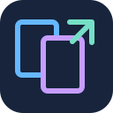
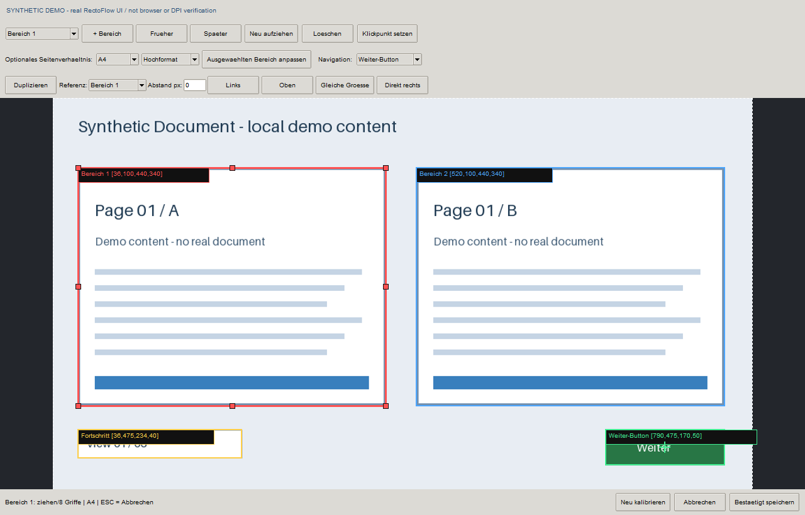
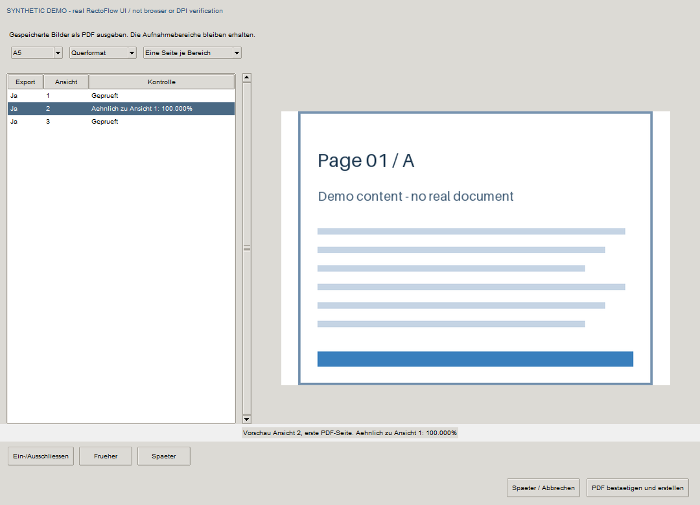

# RectoFlow

**Status: Early Windows prerelease.** Edge is runtime-verified only for the
[documented tested paths](docs/COMPATIBILITY.md). Chrome, Brave and Firefox support
is implemented and contract-tested, but runtime E2E is **unverified**. Physical
125%/150% desktop composition is also unverified. This is not production
certification across every browser/DPI combination.



**Select screen regions. Capture each view in order. Export one PDF.**

RectoFlow is an open-source Windows desktop tool for capturing one, two or many
rectangles from an already open Brave, Edge, Firefox or Chrome window. It can
advance through a document with a Next button, wait for manual navigation, or
capture a single view. At the end, choose the PDF paper size and orientation.

[Deutsche Anleitung](README.de.md) · [User guide](docs/USER_GUIDE.md) ·
[Browser compatibility](docs/COMPATIBILITY.md) · [MIT license](LICENSE)

## Why this exists

RectoFlow turns browser-based document views into ordered local PDFs when a
reliable export is unavailable or manual screenshots would be repetitive and
error-prone.

## UI demo — synthetic data

These are the real calibration and review components displaying deterministic
local demo images. They contain no real webpages or documents and are **not
runtime browser/DPI evidence**. [Regenerate the screenshots](docs/DEMO_ASSETS.md).





The capture adapter uses native Windows screenshots; see the
[FireShot integration assessment](docs/FIRESHOT.md).

## Windows download

Get the portable Windows x64 ZIP from [Releases](https://github.com/severinafrancic/RectoFlow/releases).
Extract the **whole ZIP** into a writable folder and open `RectoFlow.exe`.
Keep `_internal` beside the executable. Python is included; a separate Python
installation is unnecessary. Version 0.2 remains an unsigned **prerelease**.

## How it works

1. Open your document in a supported browser on the primary monitor.
2. Start RectoFlow, create/import a profile or choose a config, then select
   **Bereiche kalibrieren** and explicitly choose the browser window.
3. Choose one or more rectangles. Add, delete, move, resize and reorder them.
   The list order is the PDF order. Choose automatic Next, manual or single-view navigation.
4. Review the fresh final preview and explicitly confirm the selection.
5. Start capture separately. New calibrations require another current preview confirmation.
6. Review saved views, exclude or reorder whole views, then select A4, A5, A3, A6, A2, A1, A0, Letter, Legal or original dimensions;
   portrait or landscape; one PDF page per region or all regions of each view side by side.

Paper changes after capture preserve the original PNGs. Images are fitted
proportionally, without stretching or additional PDF clipping. A cancelled
export keeps the captured data for later export.

## Features

- One, two, three or as many independently selected regions as you need;
  there is no fixed limit on the number of rectangles. Add them with **+ Bereich**
  and choose their capture order.
- Eight resize handles and free geometry; optional confirmed aspect adjustment.
- Reusable independent profiles, duplicate/alignment tools and retained config backups.
- Automatic Next with fresh UIA state or explicitly calibrated image templates.
- Manual navigation and single-view capture without a Next button.
- Experimental local bookmarklet/JSON-file DOM proposals for the first two regions, Next and progress;
  full manual screenshot selection for every region.
- Physical screen pixels, selected-window binding and window/monitor/DPI checks.
- Frozen capture manifests, immutable PNGs, thumbnail review and reproducible similarity/contrast warnings.
- Persisted ExportPlans and linked manifest/plan/PDF hashes for every new 0.2 export.
- Friendly launcher plus a command line interface.

## Run from source

Windows x64, Python 3.11+:

```powershell
py -m venv .venv
.\.venv\Scripts\python.exe -m pip install -r requirements.txt
.\.venv\Scripts\python.exe rectoflow.py
```

```powershell
.\.venv\Scripts\python.exe rectoflow.py --calibrate
.\.venv\Scripts\python.exe rectoflow.py --preview
.\.venv\Scripts\python.exe rectoflow.py --capture
.\.venv\Scripts\python.exe rectoflow.py --rebuild "aufnahmen\run_..." --paper A5 --orientation landscape
.\.venv\Scripts\python.exe rectoflow.py --rebuild "aufnahmen\run_..." --export-plan "aufnahmen\run_...\exports\...\export_plan.json"
```

## Compatibility and limits

The window adapter accepts all four browsers. Screen capture and image-template
button recognition are browser-independent. UIA still depends on the browser,
the page and its accessibility provider; an unknown state stops rather than
pretending the document ended. [The compatibility matrix](docs/COMPATIBILITY.md)
distinguishes implemented support from executed runtime verification.

Use the primary monitor and keep the target layout stable. Both automatic and
manual capture have bounded view counts. ESC or the top-left screen corner
stops acquisition. A long-lived loading screen or temporarily disabled button
can resemble an end state: use a reliable progress indicator and known view count
where available. This release does not claim universal page-load detection.
An interrupted RUNNING manifest is never treated as complete or automatically
finalized. Recovery/resume of that run is outside 0.2.

## Privacy

Acquisition and export stay local. RectoFlow has no telemetry, cloud upload,
account login, remote debug port or required browser extension. Your captured
images, document titles, manifests and local configuration should remain private;
they are excluded from the Git repository and release bundle.

## Development and license

See [development](docs/DEVELOPMENT.md), [configuration](docs/CONFIGURATION.md),
[contributing](CONTRIBUTING.md), [security](SECURITY.md) and [third-party notices](THIRD_PARTY_NOTICES.md).
Project code is MIT-licensed; bundled dependencies retain their own licenses.
Builder verification and independent review do not imply owner acceptance or production verification.
